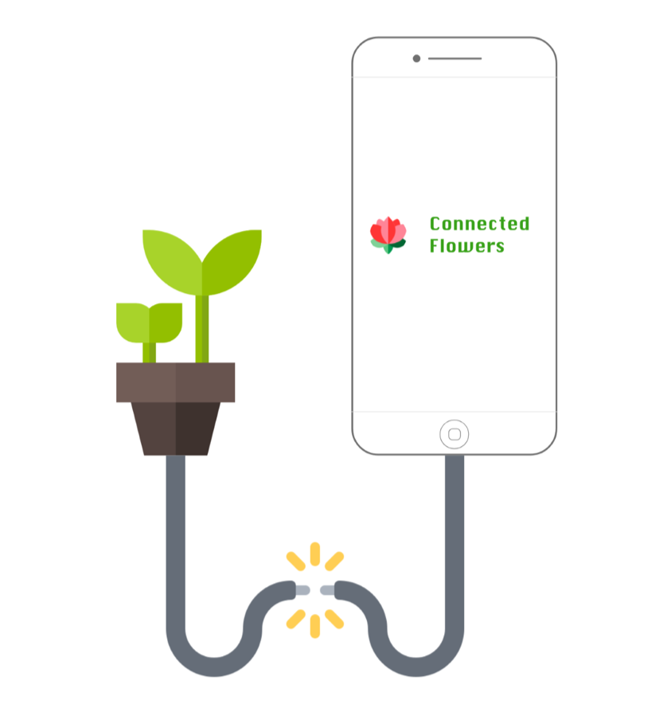
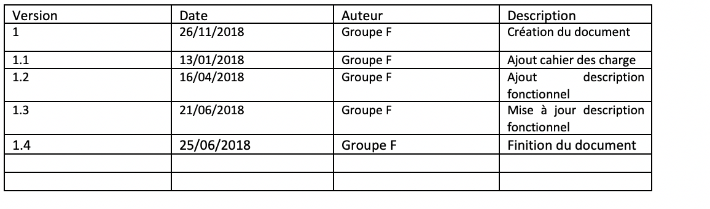
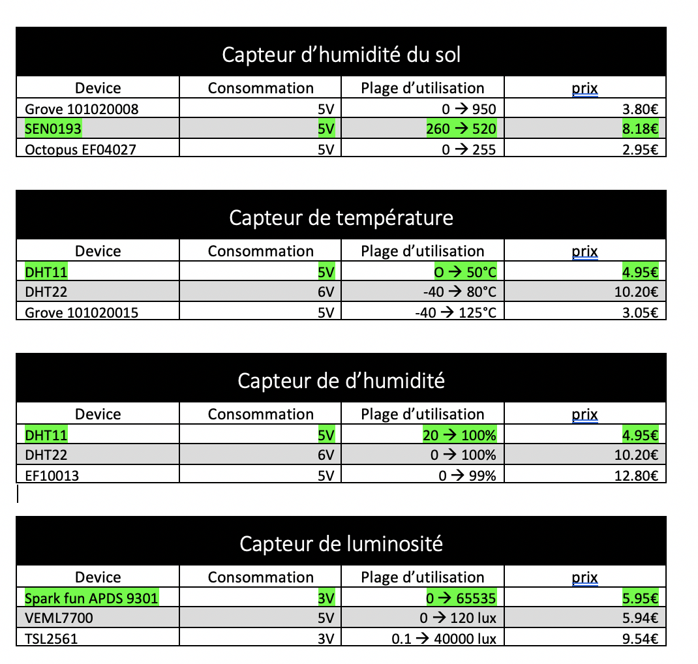
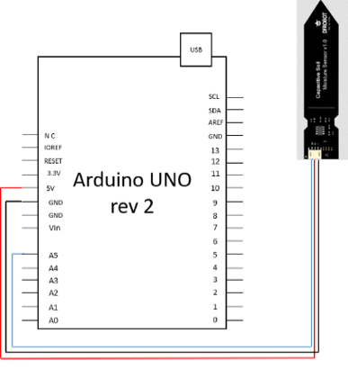
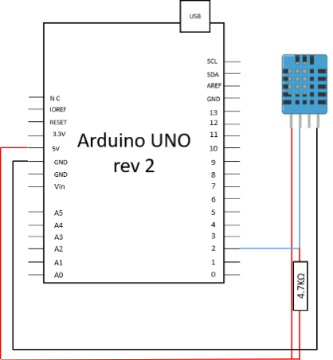
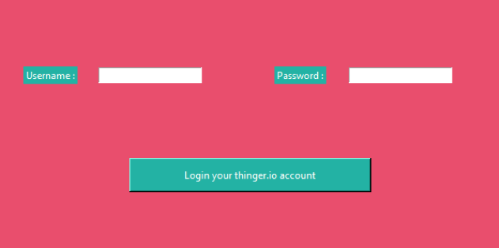
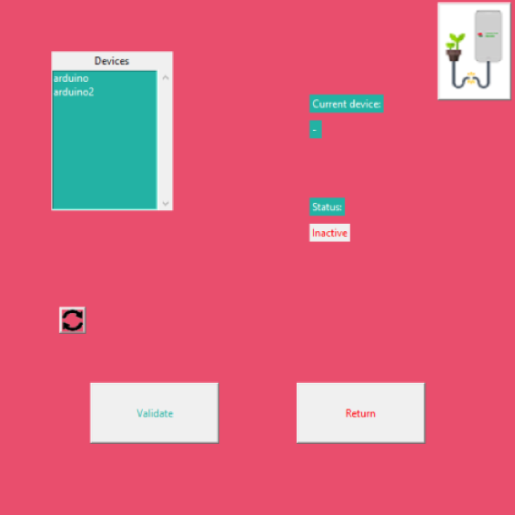
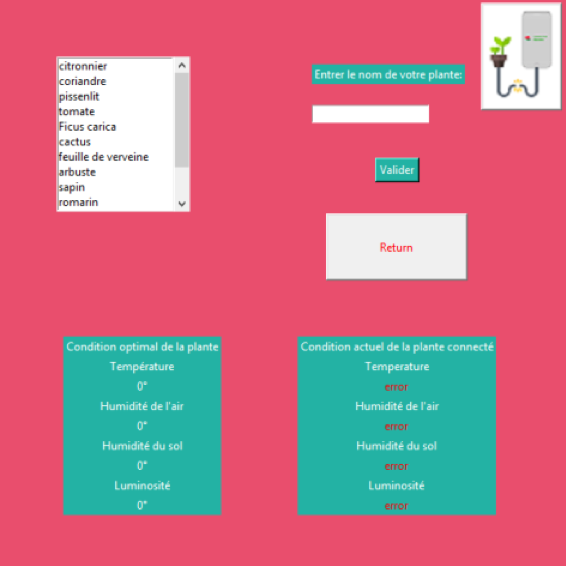

# DOSSIER PLANTES CONNECTÉES

### Connected Flowers





================================

### Table des matières

Historique du document

Introduction

Objectif du document

Droit :

Présentation de l’entreprise

L’historique

L’équipe

Les objectifs

Les outils

Présentation Projet

Les besoins

Problématique

Axe de réflexion

Cahier des charges

Description Fonctionnelle

Architecture de la solution

Choix du matériel

Capteur d’humidité du sol

Capteur de température

Capteur de d’humidité

Capteur de luminosité

Méthode de fonctionnement

1.  Collecte des données

2.  Communication des données

3.  Affichage des données

Bilan projet

Problème rencontré

Ouverture

Conclusion

=======================================================

# Historique du document





**Document Réalisé par le groupe F :**

Julien Khabbaz & Guillaume Faugeron & Quentin Fayet

**A l’attention de l’entreprise :**

Connected Flowers

# Introduction

## Objectif du document :

Ce document décrit la démarche de réalisation du projet plante connectées, ainsi que les objectifs de l’entreprise Connected Flowers.

## Droit :

Aucune partie de ce document ne peut être reproduite, archivée ou transmise sous aucune forme ou par quelconque moyen, électronique, mécanique, ou autre, sans accord préalable et écrit de Julien Khabbaz, Guillaume Faugeron ou Quentin Fayet.

# Présentation de l’entreprise

##  L’historique :

Crée en 2018, Connected Flowers est une entreprise de solution logiciel pour entreprise et particulier. Constituer de 3 membres, notre établissement nouvellement crée a pour seul mots d’ordre « ambition, liberté, adaptabilité »

##  L’équipe :

Un groupe de trois personne travaille en continu sur le projet plante connectée :

--Guillaume Faugeron : chef de projet, expert phyton

--Quentin fayet : expert Arduino

--Julien Khabbaz : architecte application

##  Les objectifs :

L’entreprise a pour ambition de révolutionner l’approche de la botanique, en simplifiant le suivi de croissance des plantes. Connected Flowers espère dans les cinq années à venir devenir un acteur incontournable du marché de la botanique-numérique.

##  Les outils :

La réalisation de ce projet avait pour exigence un travail d’équipe et une organisation sans faille pour des besoins de productivité et pour le bien des clients. A cette fin nous nous sommes servi d’outils de communication tel que discord pour un partage de fichiers et de la communication de travail dans l’équipe, ainsi que de Skype entreprise pour réaliser nos réunions de planification et préparation. De plus, nous nous servons de la suite office 365 et plus précisément de One drive, pour stocker et partager les données volumineuse et importante (son principal intérêt est une gestion des sauvegardes simplifié pour toute l’équipe). Enfin GitHub nous aura aidé à sauvegarder notre code pour le faire vérifier par la communauté ainsi que de se servir de librairie partagée sur GitHub.


# Présentation Projet

##  Les besoins :

Au cours du dernier siècle, les technologies liées au numérique n’ont cessé de se s’implanté dans la conception de l’agriculture (surveillance GPS, analyse en temps réel des besoins des plante, distribution d’eau automatisé, etc.…), cependant ces technologies sont destinées à des professionnels et ne sont pas adapté à l’usage quotidien d’un particulier.

##  Problématique :

Comment pourrons nous apporter une solution simple et efficace pour surveiller l’environnement d’une ou plusieurs plantes ?

##  Axe de réflexion :

Pour répondre à cette question, nous avons travaillé sur trois solutions.

--Solution 1 : crée un module qui récupère les données de la plante et les affiche en temps réel

- --Solution 2 : récupérer les valeurs de la plante et les stocker sur un périphérique de stockage

--Solution 3 : récupérer les valeurs de la plante, et les afficher sur un logiciel client.

Au vu du besoin énoncé dans la problématique, nous avons décidé réaliser le projet numéro 3.

# Cahier des charges

--Posséder une base de données comportant les caractéristiques suivantes :

- Le nom de la plante

- Une Catégorisation de la plante

- La Description

- Une ou plusieurs Photos

- L’humidité optimale du sol,

- La température atmosphérique optimale

- La luminosité optimale

- La période de floraison

--Un module pouvant récupérer les informations suivantes :

- La luminosité ambiante

- L’humidité atmosphérique

- La température atmosphérique

- L’humidité du sol

--Un application cliente qui soit simple d’utilisation pouvant récupérer les informations du module, et les comparé à la base de données.

# Description Fonctionnelle

##  Architecture de la solution :

Notre produit se présente de la manière ci-contre :

```

```

Notre module (_Fig. 4)_ récupère les informations de trois capteur, capteur de température et d’humidité atmosphérique (_Fig. 1_), capteur de luminosité (_Fig. 2_) et capteur d’humidité du sol (_Fig. 3_), qu’il envoie alors au serveur (_Fig. 5_).

Le client (_Fig. 6_) récupère alors les données du serveur et les affiche. L’utilisateur peut alors choisir une plante de référence pour comparer les données. Une fois la plante de référence choisi, le client peut alors afficher les données de référence contenue dans la base de données en local (_Fig. 7)_. L’utilisateur pourra alors comparer les valeurs de référence aux valeurs renvoyer par le module.

##  Choix du matériel :

Notre projet a besoin pour fonctionner des caractéristiques suivantes :

--Un capteur d’humidité du sol

--Un capteur de luminosité

--Un capteur de température atmosphérique

--Un capteur de d’humidité atmosphérique

Notre module devant être vendu a des particulier, nous devons être compétitif au niveau du prix, tout en ayant un des capteurs pouvant supporter un climat continental européen. Pour cela nous avons fait un tableau comparatif des différents capteurs dont nous avons besoin.





Les capteurs choisis sont les capteurs les plus adapté à une utilisation occidentale. Leur utilisation simplifiée ainsi que leur nombre peu important permettront un suivit de l’application cliente plus accessible.

##  Méthode de fonctionnement :

Le fonctionnement de notre module peut être réduis à trois étapes :

1. Collecte des données

2. Communication des données

3. Affichage des données

1.Collecte des données :

La collecte des données des capteur s’effectue grâce à une carte micro contrôlé « Arduino ». Sur cette carte son branché les capteurs choisis plus haut comme suit :

--Le capteur d’humidité du sol :





Ce capteur nécessite un calibrage avant utilisation pour récupérer un pourcentage précis, cependant il est commun de retrouver dans sa documentation technique qu’il a pour minimal 260 (un enivrement sec) et pour maximal 520 (un environnement liquide).

--Le capteur de température, humidité :





Le choix de ce capteur était judicieux, grâce à une librairie simple d’utilisation, nous avons pu maximiser l’efficacité du module avec la mesure de deux valeurs, la température et la luminosité. Ce capteur est un gain de place, de temps, d’argent, il est parfaitement adapté à ce module qui a pour but de satisfaire un public de particulier.

--Le capteur de luminosité :


Le capteur d’intensité lumineuse requière l’ajout d’un modulateur de tension afin de passer d’une tentions en entrée de 5V a une tension en sortie de 3.3V pour que le capteur puisse fonctionner correctement.

Principe de fonctionnement :


Synthèse :

Ces trois capteurs récupèrent les valeurs en continue des lors que le module sera connecté. Au vu du nombre de câble qui constitue le module, nous conseillons fortement la création et l’utilisation de circuit imprimer. Ils auront l’avantage de prendre moins de place et de générer moins d’erreur de faux contact.

2.Communication des données :

Pour l’échange de donné entre la carte nous avons fait le choix d’utiliser « thinger.io ». « Thinger.io » est une infrastructure cloud qui permet de connecter des périphériques à internet. Cependant si le produit se démocratise comme escompté nous conseillons l’acquisition d’un serveur dédié a ce module pour plus de stabilité et d’option d’évolution.

Principe de fonctionnement :


3.Affichage des données :

Lorsque l’utilisateur lance le client, il doit tout d’abord s’authentifier afin d’éviter la fuite d’information personnel.





Après s’être identifié celui-ci devra sélectionner le module qu’il souhaite consulter, chaque module aura sa propre ID (nommé « arduino1 » et « arduino2 » dans l’exemple ci-dessous).





Enfin l’utilisateur pourra sélectionner une plante de référence pour comparer ses valeurs avec les valeurs optimal du plant.





Enfin à la fin de son utilisation, l’usager pourra se déconnecter du client.

Principe de fonctionnement


# Bilan projet

## Problème rencontré :

Lors de la réalisation de de ce projet, nous avons fait face à plusieurs difficultés :

--L’instabilité du matériel : la fait de ne pas posséder le matériel nous empêchais de le manipulé de manière précise. A savoir la création de carte électronique pour minimiser les risques de faux contact et de perte d’information. A court terme cela nous aurais grandement simplifiée la tache en évitant réglé des problèmes d’électronique et de nous concentrer sur le développement. A long terme cela aurais permis une plus grande stabilité et donc une croissance plus rapide du projet (entrainant pas la même occasion l’ajout de nouvelle fonctionnalité)

--Un mauvais choix de composant : le fait d’avoir choisis la solution « thinger.io » nous a limitée dans notre démarche. Ce serveur étant utilisé pour un grand nombre de personne dans le monde, nous étions limités à un certain débit de requête ralentissant grandement notre vitesse de travail.

##  Ouverture :

La présentation d’une maquette fonctionnelle n’est que l’effleurement du potentiel de ce projet. Voici quelque axe d’amélioration pour des mise à jour futur (cette liste est non exhaustive).

--Autonomie : le module dois aujourd’hui est relié à un secteur pour être alimenté en électricité. Avec l’ajout d‘une batterie nous pourrions rendre le module plus accessible et plus adapté à son environnement.

--Gérer la base de données coté serveur. L’ajout d’une base de données coté serveur permettrais la libération de données sur l’application. Ainsi l’utilisateur aurait à sa disposition une base de données complète, détaillé et mise à jour sur son client.

##  Conclusion 

Afin de conclure voici les instructions de lancement de notre plateforme de plante connectée :

--Compiler le code source arduino en ayant réalisé les branchement décrit précédemment.

--Ouvrir le main.py avec IDLE 3.7 puis lancer le code avec f5, suivre les instructions de l'interface.
 
